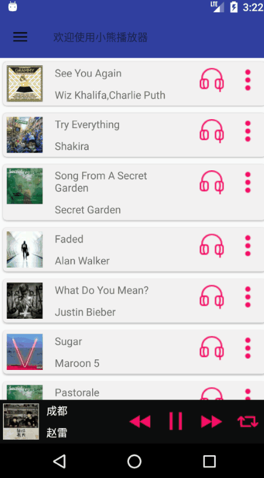

# MyMusic

这是一个简单的android音乐播放器

## 截图

## 使用到的框架
- 网络：retrofit2，okhttp3
- 图片：Glide
- 列表：XRecyclerview
- 歌词：zhengken:LyricViewDemo
## 使用到的知识点
- 页面：Activity，Fragment，ViewPager
- 列表：Recyclerview
- 进度条：seekbar
- 菜单：Popupmenu
- 抽屉：DrawerLayout
- 广播：BroadcastReceiver
- 服务：service
- 数据存储：Sqlite，SharedPreferences
## 实现的功能
- 侧滑菜单，展示音乐类型，点击可进入相应的歌曲列表页面
- 歌曲列表展示，点击item进行播放
- 歌曲的收藏，下载功能
- 歌曲的上一首，播放，下一首，循环模式
- 歌词展示，使用第三方框架实现了歌词的展示，拖动快进
- 播放页面歌曲图片的旋转，暂停播放图片同步停止旋转，恢复播放后从停止处进行旋转
- 实现了播放进度条，可进行拖动调节播放进度，并显示了当前播放进度的时间与歌曲的总时间
- 实现了本地音乐的播放
## 关于我
- 邮箱：<fairyland-cat@foxmail.com>
- 简书：<http://www.jianshu.com/u/18a99f29b0ca>

## 声明
- 数据来源于百度音乐，仅用于个人学习使用
- 播放器还有很多不足，比较粗糙，不过适合初学者参考，欢迎大家对不足处进行指教与交流
